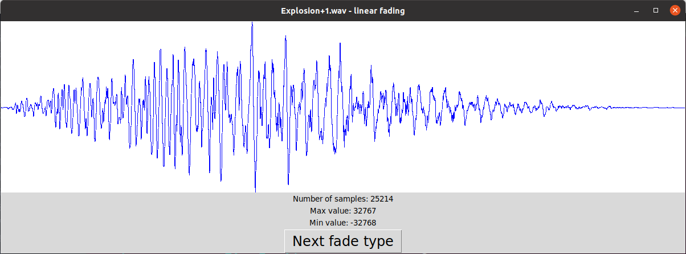

WAV Audio Visualization
=======================
Uses Python3 and the Tkinter GUI library.
To run, use `python3 wav-audio-visualization.py`

Select a .wav file from the open file prompt. The program will then take a second to draw the waveform. The window can be resized and the waveform will be redrawn automatically to fill the space. The 'Next fade type' button can also be pressed to cycle through linear fading, quadratic fading, exponential fading, logarithmic fading, and no fading.

Note: only 8-bit and 16-bit mono WAV files are supported.
